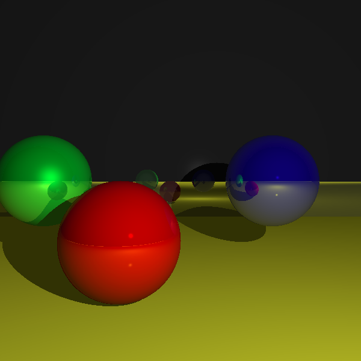
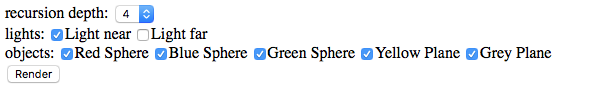

# In-browser Ray Tracer implemented in Javascript

## How to play with it
Open [the link](http://minghuiliu.com/ray_tracer) in your browser and wait for the image to be rendered. This can take from a few seconds to a minute depending on your machine. 

Use the checkboxes to modify the scene and hit render button to render again.

## Graphics features
* Object intersection of planes and spheres
* Point light
* Reflection
* Shadow
* Material
    * color
    * specular component
    * reflectiveness

## Algorithms Used
### Primary Ray
Each pixel shoots one primary ray, which originates from the camera postion. The ray travels in the direction of the center of the pixel - camera position.

### Object Intersection
Each primary ray intersects zero or more objects. If the ray hits an object, the intersection with the lowest t value larger than epsilon is returned, along with the object properties useful for shading (such as color, normal, etc.). Each type of object has its own hit() method for calculating intersection with a ray. If a ray does not intersection any object, background color is returned.

### Shading
This ray tracer uses a simple Phong light model. All objects have ambient light by default. The contribution of each light, including diffuse light and specular light, on the a intersection point is calculated and accumulated.

### Shadow
A shadow ray is casted from an intersection to each light. If the shadow ray hits an object, then the intersection point is in the shadow of that object and a shadow color is returned.

### Reflection
A reflection ray is casted from each intersection point and the returned color is added to the color of the intersection point after being multiplied by the relfectiveness of the object surface. This procedure is recursive so a limit is set on the recursion depth.

## Third-part Library

[gl-matrix.js](https://github.com/toji/gl-matrix) was used for all the vector calculations, including add, subtract, dot product and scaling, etc. gl-matrix.js vector calculation functions look like this: `vec3.function()`. Some of the most used functions in this project are:
* vec3.create()
* vec3.fromValues()
* vec3.add()
* vec3.sub()
* vec3.dot()
* vec3.scale()
* vec3.scaleAndAdd()

## Acknowledgement
Special thanks to Professor Peter Yoon for his book on ray tracing. 

Thanks to Brandon Jones and Colin MacKenzie for their [gl-matrix.js](https://github.com/toji/gl-matrix) math library.